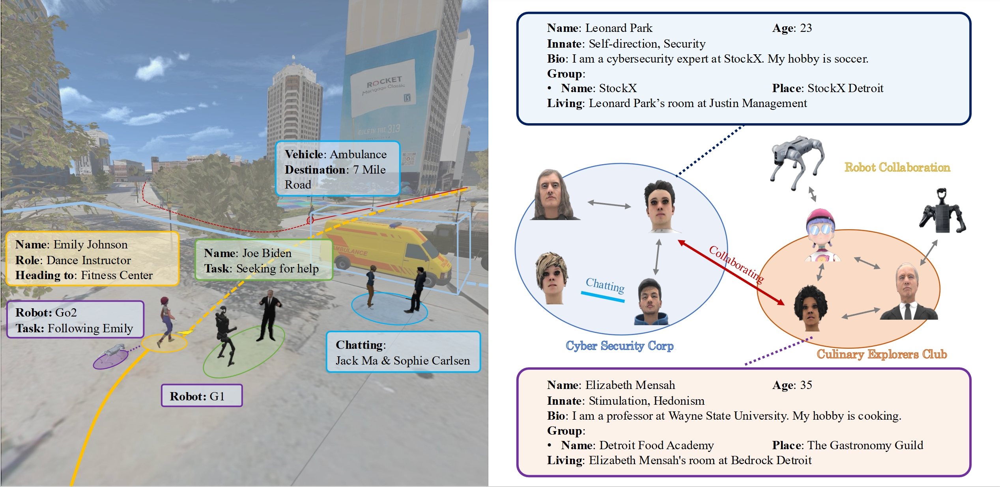

<p align="center">
  <h1 align="center">
  Virtual Community: An Open World for<br />
  Humans, Robots, and Society
</h1>
  <p align="center">
    Anonymous authors
  </p>
  <p align="center">
    <a href='https://virtual-community-ai-25.github.io/' style='padding-left: 0.5rem;'>
      
    </a>
  </p>

Virtual Community is an open-world platform that simulates human-robot coexistence in shared communities, featuring a physics-based multi-agent simulator and real-world 3D scenes to study embodied social intelligence at scale.

<p align="center">
    
</p>

<!-- TABLE OF CONTENTS -->
<details open="open" style='padding: 10px; border-radius:5px 30px 30px 5px; border-style: solid; border-width: 1px;'>

  <summary>Tabel of Contents</summary>
  <ol>
    <li><a href="#news">News</a></li>
    <li><a href="#getting-started">Getting Started</a></li>
    <li><a href="#acknowledgement">Acknowledgement</a></li>
    <li><a href="#citation">Citation</a></li>
  </ol>
</details>

## News
- [2025-06-19] We have released the Virtual Community! Check out the [project website](https://virtual-community-ai-25.github.io/) and our paper for more details.

## Getting Started

### Installation

We're using python 3.11, cuda 11.7 and ubuntu 24.04. If you are using a different version, please modify the env.yaml file accordingly.

```bash
conda env create -f env.yaml
```

Install Genesis from the source:

```bash
cd Genesis
pip install -e .
```

To run the example tour agent, install volume grid lib:

```bash
cd agents/sg
./setup.sh
```

### Assets Preparation

Download the assets from the [Google Drive](https://drive.google.com/drive/u/2/folders/15XR80efNfgdpYi-5dXh3lJ35p9WBqFc5) and organize them under `Genesis/genesis/assets/ViCo`.

Assets include:
- `scene` folder: contains the generated outdoor 3D scenes.
- `robots` folder: contains the robot models.
- `objects` folder: contains the object models.
- `avatars` folder: contains the human avatars' skin and motion.
- `cars` folder: contains the vehicle models including car, bus, bike, etc.

If you want to use indoor scenes from GRUTopia, please follow their instructions [here](https://github.com/OpenRobotLab/GRUtopia?tab=readme-ov-file#%EF%B8%8F-assets) to download the commercial_scenes.zip, and unzip it under `Genesis/genesis/assets/ViCo/`.

After this step, the directory structure should be:

```
Genesis/genesis/assets/ViCo/
├── scene/
├── robots/
├── objects/
├── avatars/
├── cars/
└── commercial_scenes/ (optional)
```

### Run the Simulation

Run the following script to test the simulation, where 15 agents will tour around the New York Scene.

```bash
./scripts/run_tour_agent.sh
```

Tips: Loading all indoor scenes and objects may take around 40G memory. If you encounter memory issues, consider adding `--no_load_indoor_scene` flag to the script to disable indoor scenes.

### System Requirements

#### System Memory (RAM)
<ul class="list-disc ml-6">
  <li>**Minimum**: 24 GB</li>
  <li>**Recommended**: 32 GB</li>
</ul>

#### GPU Memory (VRAM)
<ul class="list-disc ml-6">
  <li>**Minimum**: 10 GB</li>
  <li>**Recommended**: 16 GB</li>
</ul>

#### Disk Space
<ul class="list-disc ml-6">
  <li>**Minimum**: 60 GB</li>
  <li>**Recommended**: 100 GB</li>
</ul>

### TroubleShooting

If you encounter any issues, please check the following:

`libstdcxx. so.6: version GLIBCXX 3.4.32’not found required by  sg/builder/builtin/libbuider.so)`

To resolve this issue, you may need to update your GCC runtime. You can do this by running:

```bash
conda install -c conda-forge libstdcxx-ng
```

---

Only _pygltflib-1.16.0_ works for now, the latest version _pygltflib-1.16.1_ will slower the scene loading.


## Acknowledgement
Virtual Community is built on lots of amazing open-source projects:

- [Genesis](https://github.com/Genesis-Embodied-AI/Genesis): Universal physics engine backend. Thanks for the team for their great work on Genesis, which provides the foundation for our project.
- [GRUtopia](https://github.com/OpenRobotLab/GRUtopia): The indoor scene dataset we used for retrieval.
- [ARCHITECT](https://github.com/wangyian-me/architect_official_code/): The indoor scene generation method we used.
- [Google 3D Tiles](https://3d-tiles.web.app/): The source of our outdoor scene data.
- [OpenStreetMap](https://www.openstreetmap.org/): The source of our outdoor scene data.
- [Blender](https://www.blender.org/): The 3D modeling software we used to create and modify the assets.
- ...

And inspiring works that influenced our design and implementation:
- [Generative Agents](https://github.com/joonspk-research/generative_agents): Inspiring our character generation.
- [V-IRL](https://virl-platform.github.io/): Inspiring our leverage of real geospatial data.
- ...

With many more not listed here, we are grateful for the contributions of the open-source community that made this project possible.